# BEES-STRESSORS
# shannon erickson

description:

This project looks at pesticide use trends from 1992 to 2019 in the United States along with Colony Collapse Disorder (CCD) Honeybee Colony Survey 
Data from 2015-2019. It is my intention to see if there were trends in these data sets as CCD is an important factor in Honeybee loss and health.
Additionally, CCD does not seem to have one cause, but is possibly a mixture of different issues including
habitat loss/degradation, malnutrition for bees, climate change, pests, diseases, genetics, pesticides, management practices, and more.
CCD is the phenomenon where bees abandon their hives for typically unknown reasons, which is different than colony loss from death as in CCD 
there are little to no dead bees found at the hive.
Taking care of our pollinators is important for multiple reasons, one being that it simply is the right thing to do 
to care for living things and each other (and also I love *bees*). Beyond that, pollinators such as bees are incredibly important in supporting
biodiversity (and with that the environment!), agriculture and the economy, food production, and more. 
This being said, it is important to look into the relationship between Honeybee populations and the different stressors associated with CCD

data inputs:

1. HighEstimate_AgPestUsebyCropGroup92to19.txt

2. LowEstimate_AgPestUsebyCropGroup92to19.txt

These two data files are used in the high_pest_estimate and low_pest_estimate scripts.
They are the estimated annual pesticide use for the United States between 1992 and 2019
They reflect a high and a low estimate for pesticide use
Citation:
Wieben, C.M., 2021, Estimated annual agricultural pesticide use by major crop or crop group for states of the conterminous United States, 1992-2019 
(including preliminary estimates for 2018-19): U.S. Geological Survey data release, https://doi.org/10.5066/P900FZ6Y.
Website I found the data on: 
https://www.sciencebase.gov/catalog/item/6081ae7cd34e8564d6866222

These two txt files were converted into csv files through python

3 - 14
are from https://usda.library.cornell.edu/concern/publications/rn301137d?locale=en
The listed PDFs were used to create new CSV files (There were CSV files on the site; however it was more productive for me to create a newly 
formatted CSV with the data)

3. BeeColonies-05-12-2016.pdf 
4. beespop2015.csv
5. ccd_2015.csv
The PDF is sourced from the USDA/Cornell website and information was taken from it to create 2 csvs with excel
#4 is quartlerly bee population data from 2015
#5 is annual colonies affected by CCD STRESSORS

6. BeeColonies-08-01-2017.pdf
7. beespop2016.csv
8. ccd_2016.csv
The PDF is sourced from the USDA/Cornell website and information was taken from it to create 2 csvs with excel
#7 is quartlerly bee population data from 2016
#8 is annual colonies affected by CCD STRESSORS

9. BeeColonies-08-01-2018.pdf
10. beespop2017.csv
11. ccd_2017.csv
The PDF is sourced from the USDA/Cornell website and information was taken from it to create 2 csvs with excel
#10 is quartlerly bee population data from 2017
#11 is annual colonies affected by CCD STRESSORS

12. hcny0819.pdf
13. beespop2018.csv
14. ccd_2018_april_june.csv
The PDF is sourced from the USDA/Cornell website and information was taken from it to create 2 csvs with excel
#13 is quartlerly bee population data from 2018
#14 is colonies affected by CCD STRESSORS between april and june of 2018 because there was not annual data, so one quarter was selected

12. hcny0820.pdf
13. beespop2019.csv
14. ccd_2019_oct_dec.csv
The PDF is sourced from the USDA/Cornell website and information was taken from it to create 2 csvs with excel
#13 is quartlerly bee population data from 2019
#14 is colonies affected by CCD STRESSORS between october and december of 2019 because there was not annual data, so one quarter was selected

Citation: 
USDA. (n.d.-b). Publication | Honey Bee Colonies | ID: rn301137d | USDA Economics, Statistics and Market Information System. USDA/Cornell. 
Retrieved May 11, 2022, from https://usda.library.cornell.edu/concern/publications/rn301137d?locale=en

Script running order and outputs:

1.  &
2. 
high_pest_estimate.py and low_pest_estimate.py

Either script can be ran first and will show pesticide use trends through a line graph from 1992 - 2019
The following figure shows the high estimate for pesticide use from 1992 to 2019 in the US: 

The following figure shows the low estimate for pesticide use from 1992 to 2019 in the US: 

Outputs = High_pesticide.png, Low_pesticide.png 
This script shows the trends over the years for each state in pesticide use (low and high estimated use)
Additionally it sorts the lowest to highest pesticide users by state from 2015 to 2019, showing the 3 highest and 3 lowest users

Scripts 3 - 7 are the same steps repeated for years 2015 - 2019. This aims to produce graphs that can be compared to see
how the honeybee population losses change over the years as well as to see if the biggest stressors are changing. 

3. colonies_2015 - 
The following figure shows honeybee CCD loss percentages by state: 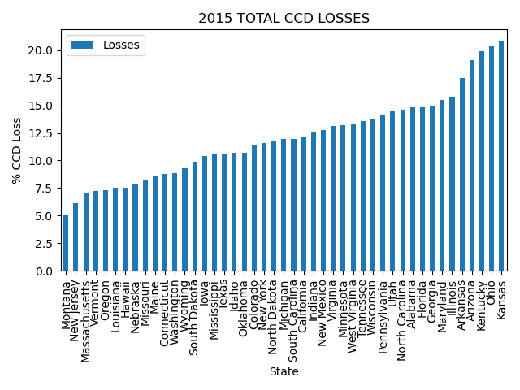

The following figure shows honeybee CCD loss percentages by the highest and lowest ranking states: 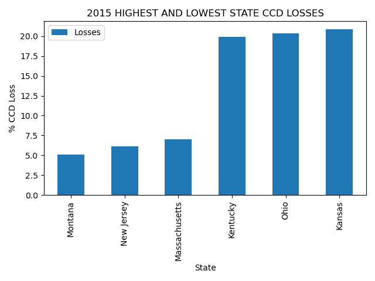

The following figure shows the different percentages of CCD stressors that US colonies faced annually : 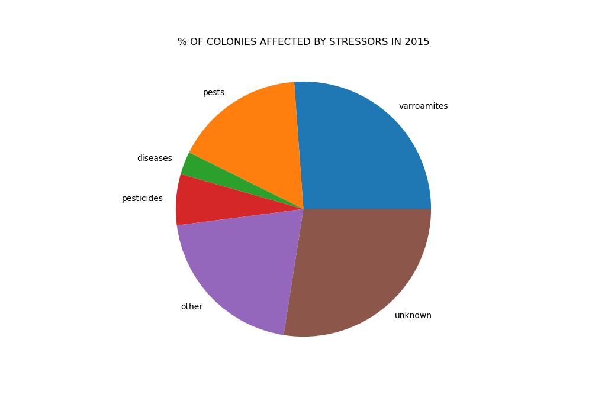

Outputs = 2015TOTALSTATECCDLOSSES.png, HIGHESTANDLOWESTSTATECCDLOSSES2015.png, PIECHART2015STRESSORSFORUS.png
This script sorts the honeybee losses by state from low to high. Then it shows the 3 states with the lowest numbers of 
honeybee losses and the 3 states with the highest numbers of honeybee losses, and then combines them.
The script prints out the ccd csv information to create two lists for the pie chart to show the different percentages of
CCD stressors that honeybee colonies are impacted by

4. colonies_2016 - 
The following figure shows honeybee CCD loss percentages by state: 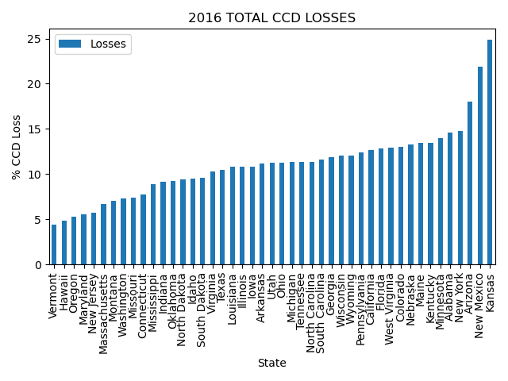

The following figure shows honeybee CCD loss percentages by the highest and lowest ranking states: 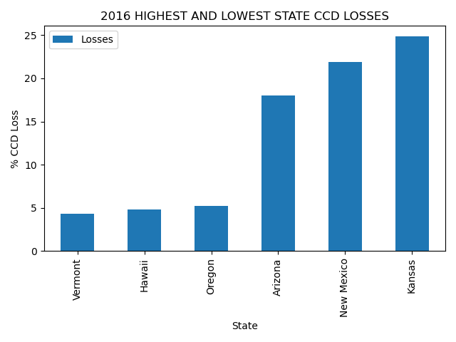

The following figure shows the different percentages of CCD stressors that US colonies faced annually : 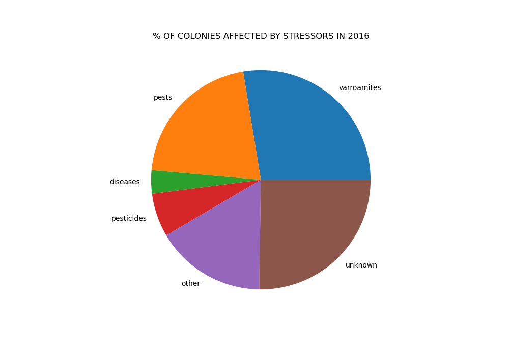

Outputs = 2016TOTALSTATECCDLOSSES.png, HIGHESTANDLOWESTSTATECCDLOSSES2016.png, PIECHART2016STRESSORSFORUS.png
This script sorts the honeybee losses by state from low to high. Then it shows the 3 states with the lowest numbers of 
honeybee losses and the 3 states with the highest numbers of honeybee losses, and then combines them.
The script prints out the ccd csv information to create two lists for the pie chart to show the different percentages of
CCD stressors that honeybee colonies are impacted by

5. colonies_2017 - 
The following figure shows honeybee CCD loss percentages by state: 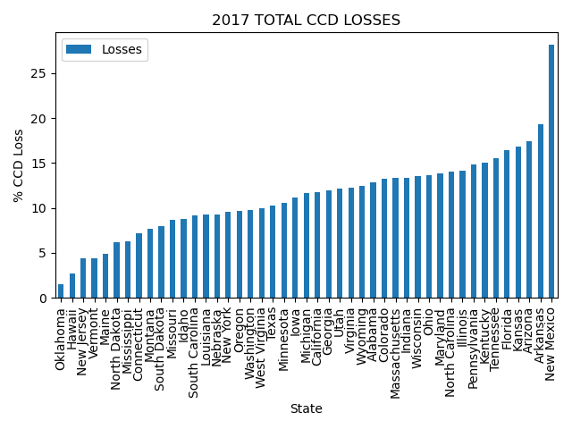

The following figure shows honeybee CCD loss percentages by the highest and lowest ranking states: 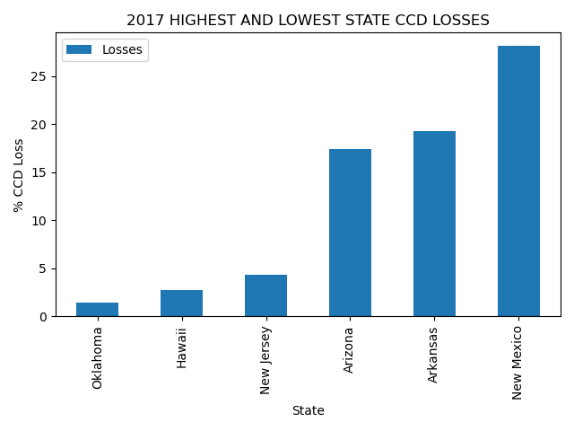

The following figure shows the different percentages of CCD stressors that US colonies faced annually : 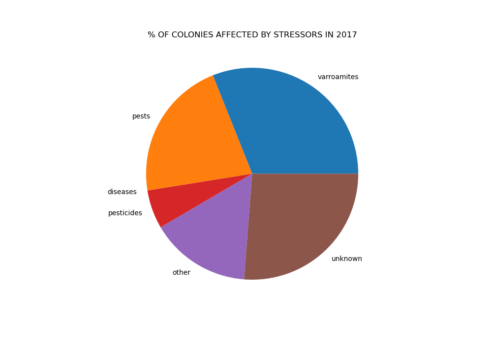

Outputs = 2017TOTALSTATECCDLOSSES.png, HIGHESTANDLOWESTSTATECCDLOSSES2017.png, PIECHART2017STRESSORSFORUS.png
This script sorts the honeybee losses by state from low to high. Then it shows the 3 states with the lowest numbers of 
honeybee losses and the 3 states with the highest numbers of honeybee losses, and then combines them.
The script prints out the ccd csv information to create two lists for the pie chart to show the different percentages of
CCD stressors that honeybee colonies are impacted by

6. colonies_2018 - 
The following figure shows honeybee CCD loss percentages by state: 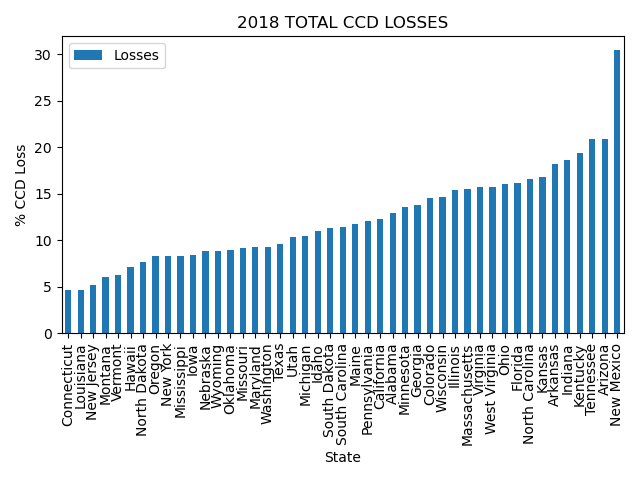

The following figure shows honeybee CCD loss percentages by the highest and lowest ranking states: 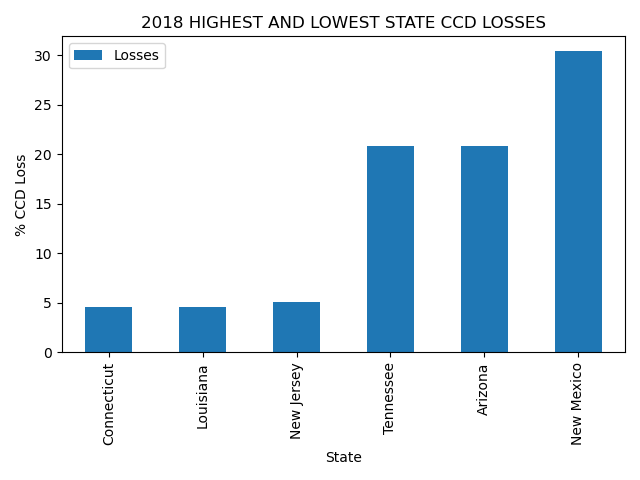

The following figure shows the different percentages of CCD stressors that US colonies faced between April to June 2018 because there was not annual data : 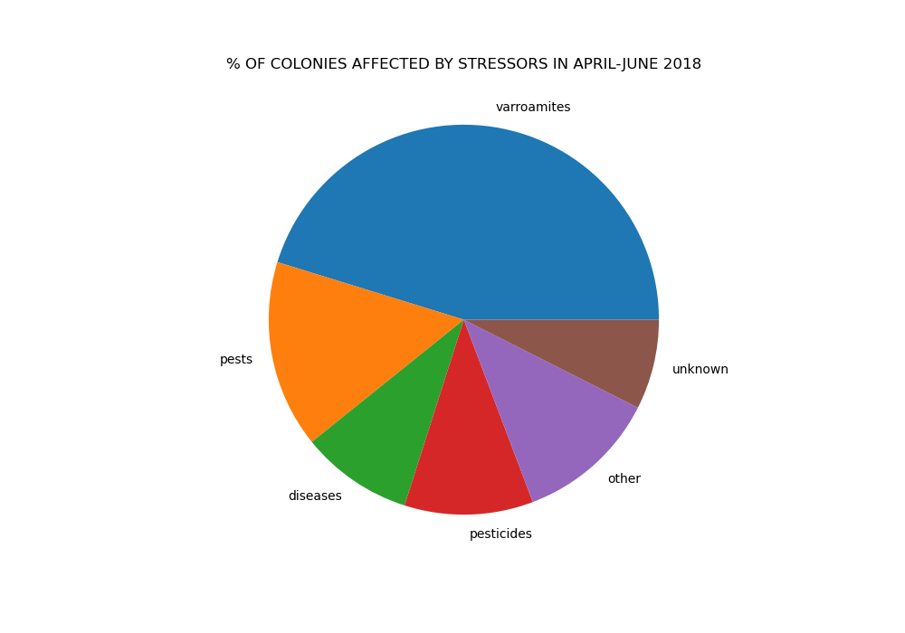

Outputs = 2018TOTALSTATECCDLOSSES.png, HIGHESTANDLOWESTSTATECCDLOSSES2018.png, PIECHART2018STRESSORSFORUS.png
This script sorts the honeybee losses by state from low to high. Then it shows the 3 states with the lowest numbers of 
honeybee losses and the 3 states with the highest numbers of honeybee losses, and then combines them.
The script prints out the ccd csv information to create two lists for the pie chart to show the different percentages of
CCD stressors that honeybee colonies are impacted by

7. colonies_2019 - 
The following figure shows honeybee CCD loss percentages by state: 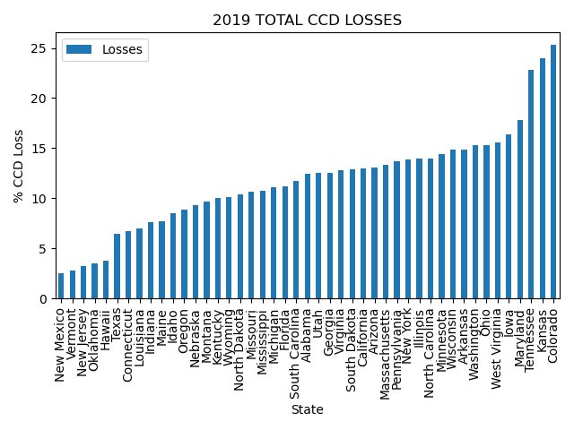

The following figure shows honeybee CCD loss percentages by the highest and lowest ranking states: 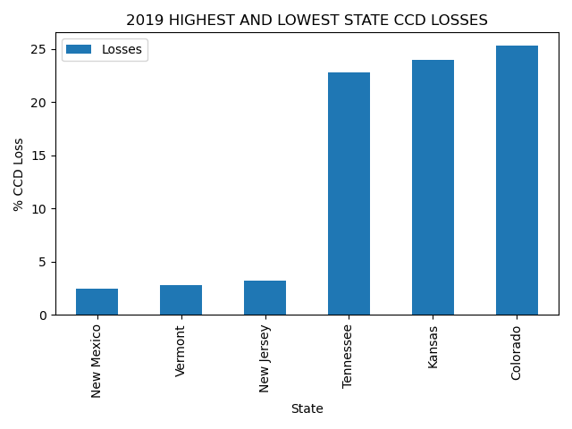

The following figure shows the different percentages of CCD stressors that US colonies faced between October to December 2019 because there was not annual data : 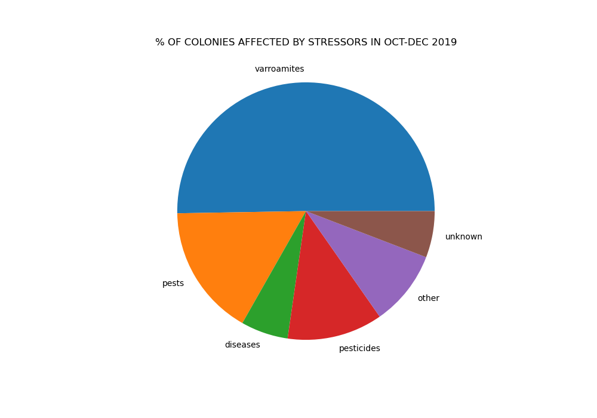

Outputs = 2019TOTALSTATECCDLOSSES.png, HIGHESTANDLOWESTSTATECCDLOSSES2019.png, PIECHART2019STRESSORSFORUS.png
This script sorts the honeybee losses by state from low to high. Then it shows the 3 states with the lowest numbers of 
honeybee losses and the 3 states with the highest numbers of honeybee losses, and then combines them.
The script prints out the ccd csv information to create two lists for the pie chart to show the different percentages of
CCD stressors that honeybee colonies are impacted by

Findings:
When looking at CCD stressors from 2015 to 2019, it was interesting to see how much
the varroamites stressor increased within the pie charts over the years: 

Additionally, New Mexico was a top state for CCD losses from 2016 - 2018, but then
had the least amount of CCD losses in 2019: 

Many of the states shifted around significantly in the CCD bar graphs and the pesticide use over the years line graph.
For example, California was the top pesticide user from 1992 and then dropped way down in the list to be using ~6.85 M kg
of pesticide compared to them using ~65.21 M kg of pesticide in 2015: 

The pesticide graphs were really interesting because although pesticides reflected a smaller portion of CCD stressors than I had
anticipated, it showed the extremely large amounts of pesticides that states are using. 
Pesticides, including neonicitinoids affect pollinators and CCD and are still important to monitor. Additionally, even if 
pesticides were not a top CCD stressor from the 2015 - 2019 data, they still have negative impacts on the environment and 
biodiversity and should be used as needed with monitoring, with ecologically friendly alternatives used when possible.
One of the biggest findings from the pesticide data was how possible it is for states to cut down their pesticide use. 
California being one of the largest states and having the ability to drop down their pesticide usage significantly shows that
it is not an unachievable goal. Furthermore, California is big on agriculture and pollination - For example, beekeepers and their
managed bees will travel to California to do almond pollination. So the point here is that even with California having a massive
agricultural event like that (among others), they still were able to cut their pesticide use significantly. 
I am not sure, but it may be that California's ban/tightening of restrictions on chemical pesticides heavily contributed
to their massive decrease of pesticide use, but to be certain I would have to research it more. 2 articles that seemed to 
relate to the topic though are:
https://www.biologicaldiversity.org/news/press_releases/2018/california-pesticides-02-26-2018.php
https://calepa.ca.gov/2019/05/08/california-acts-to-prohibit-chlorpyrifos-pesticide/

In the future, I think it would be interesting to look more into the different pesticide compounds that affect bees
to see if those graphs would correlate differently with colony collapse issues found throughout the United States. 
Additionally, looking at states with low pesticide use and lower CCD losses could be good to try to determine better
management practices for bees. 

Overall, in order to "save the bees" many things (so many things including our lives!) will have to change 
(especially large sectors like industrialized agriculture - and other production sectors) to move to being 
more environmentally friendly not only for the sake of pollinators, but also biodiversity/the environment and human health
as they are all connected. 

#save the bees (and the planet) <3

#Thank you Professor Wilcoxen for helping me start learning how to code!

